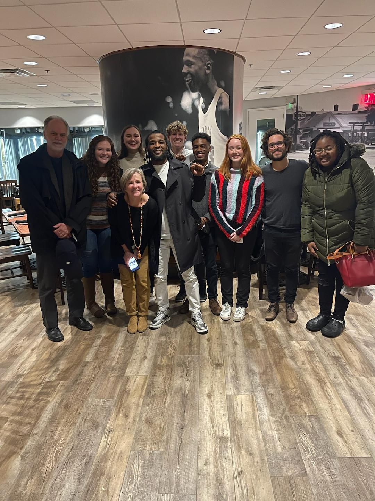

*Myself, my PI and my fellow research assistants (+ a grad student) after dinner with Jerome Morgan. Mr. Morgan was wrongly convicted of murder at seventeen and sentenced to life in prison. His innocence was recently proven, and we had the pleasure of hearing him speak at UNC in the Spring of 2022.*

Hello! I am a rising senior at the University of North Carolina at Chapel Hill. I'm working toward a Bachelor of Science in Computer Science, a Bachelor of Arts in Political Science, and a Minor in Data Science.    

I currently work as an Undergraduate Research Assistant with [Dr. Frank Baumgartner](https://fbaum.unc.edu/), who does statistical research on the death penalty. My tasks primarily consist of cleaning and reshaping data to be merged with his main database.    

After graduation I plan on puruing a Ph.D. in Political Science. My interests lie in the utilization of quantitative and computational methodologies to study political phenomena. Methodologies that interest me include the use of novel data sources (e.g., social media scraping), machine learning (e.g., natural language processing), and novel experimental designs.  

My most recent paper, written at the American Political Science Association's Ralph Bunche Summer Institute, utilizes a rare event analysis of recent survey data from the United Kingdom to explore a causal link between Uncertainty-Identity Theory (Hogg) and political radicalization.   

My future work will continue to be interdisciplinary in nature, working within teams of scholars from different backgrounds to push the boundaries of computation in social science. I'm also interested in the ethics behind data science. As I continute to do quantitative research, I'm obligated to become a responsible user and consumer of data. To that end, I'm interested in tackling issues of algorithmic bias, in academia as well as in industry.
